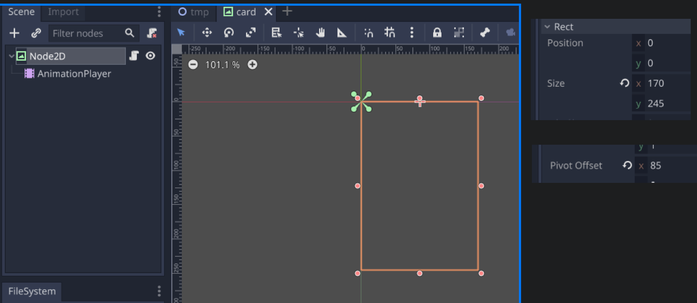
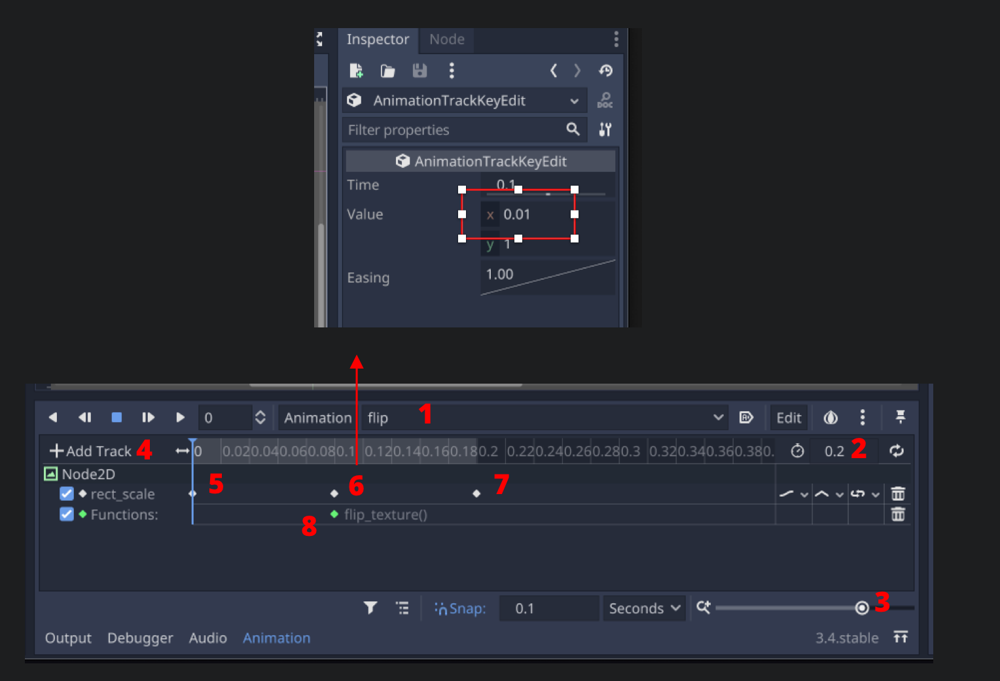
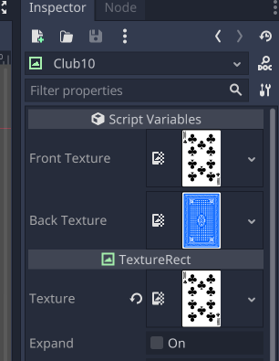
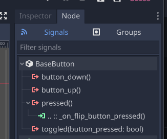

## Repo

Finished code (Godot project) can be found here:

https://github.com/justin-calleja/card-flipping

## Goal

The goal is to create flippable cards. The flip animation will be achieved via animating the `rect_scale.x` to a near zero value; change of texture; and animating the `rect_scale.x` value back to 1.

Make 2 cards. One flippable via a button close-by; and another card that can itslef be clicked to flip.

## card.tscn

The first scene, `res://scenes/card/card.tscn`, will have a `TextureRect` (named "Node2D" below, but it's actually of type `TextureRect`) with an AnimationPlayer. The `Control.Rect.Size` will have an `x` of `170` and a y of `245`. The `Pivot Offset` is set at half the `x`, at `85`. This will be important when we animate the `rect_scale.x`. If we don't change it, the animation will happen from the left side of the card.



Next, for the `AnimationPlayer`:



1. Create a new animation called "flip".
1. Adjust the duration to `0.2` seconds.
1. Adjust the timeline zoom to fit the new duration.
1. Add a track to animate the `TextureRect`'s `rect_scale`
1. Insert a key at time 0.
1. Insert a key at time 0.1 and adjust the `rect_scale.Value.x` to be `0.01`.
1. Insert a key at time 0.2.
1. Add a call method track on the `TextureRect` - but there's nothing to assign yet as we haven't written the function yet. Basically, this function will get called at time 0.1 during the animation i.e. when the card is basically invisible (we want to swap the texture based on whether the card is face up or down).

## card.gd

Now add a script on the root `TextureRect` node:

```py
extends TextureRect

onready var ap: AnimationPlayer = $AnimationPlayer

var is_face_up = false
export var front_texture: Texture
export var back_texture: Texture


func _ready():
	set_texture()


func set_texture(a_texture = null):
	if a_texture == null:
		texture = front_texture if is_face_up else back_texture
	else:
		texture = a_texture
```

We get a reference to the `AnimationPlayer` and store it in `ap` since we'll need that soon enough.

`is_face_up` is used to track whether or not the card is facing up.

`front_texture` and `back_texture` will be the 2 different images the `TextureRect` can take. A `TextureRect` has a `texture` property. Since we are `extends TextureRect`, we have access to it and in `set_texture` (which we are overriding from the parent), we flip the texture based on `is_face_up` if we pass in no argument.

On `_ready`, we `set_texture()`.

Next we add a way to `flip_texture` (which is what will be attached to the `0.1` time on the AnimationPlayer), and a `flip` function which can be used to start the animation programmatically - such that calling `flip` will call `flip_texture` 0.1 seconds later:

```py
func flip_texture():
	is_face_up = !is_face_up
	set_texture()


func flip():
	ap.play("flip")
```

## tmp.tscn

Add a new root node e.g. `Node2D`, and "Instance child scene" to instanciate a node from the `res://scenes/card/card.tscn` scene, and name it `Club10`.



Setting the `TextureRect` texture is just so we can see it in the Godot editor. When executed, the `Front Texture` and `Back Texture` will take effect.

Next add a button somewhere and give it some text like "Flip" (feel free to increase its size). We'll need to use the `pressed()` signal and attach it to a function in the `tmp` scene's root node, which doesn't have a script yet, so add one for it:



```py
extends Node2D

# Attach this to the button's pressed signal:
func _on_flip_button_pressed():
	$Club10.flip()
```

Pretty straight-forward; we're flipping the card when the button is pressed.

## clickableCard.tscn

Next we'll create a new scene based on the `card.tscn` one. From Godot's top menubar: Scene -> New Inherited Scene; and choose `card.tscn`.

Add a `Button` node as a sibling to the `AnimationPlayer` and set its size equal to the `TextureRect`'s i.e. `x` of `170` and y of `245`. Also, we don't want the button to be visible so set it's `CanvasItem -> Visibility -> Modulate -> alpha` to `0`. We don't want to tick the `Visiblie` `off` as that would make it unclickable.

That's all we need to do here; we'll attach the `pressed` signal elsewhere.

## Adding a clickableCard instance to the tmp scene

At this point, you can go back to `tmp.tscn`, add a `clickableCard` scene instance and give it a front and back texture. Add the following to `tmp.gd` script:

```py
func _ready():
	$Diamond10/Button.connect('pressed', self, '_on_diamond10_pressed')


func _on_diamond10_pressed():
	$Diamond10.flip()
```

Note that I named the `clickableCard` node instance as "Diamond10" and on `tmp` scene is ready, I'm attaching that instance's `Button` `pressed` signal to this script's `_on_diamond10_pressed` function.

Running the `tmp` scene should allow you to click the button to flip one card, and click the other card to flip itself.
