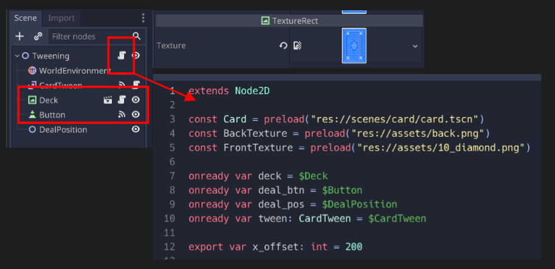
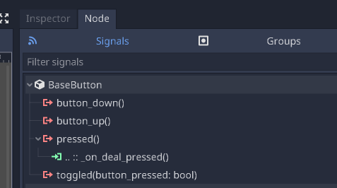
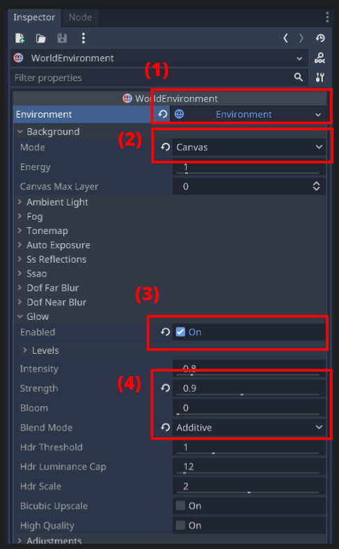
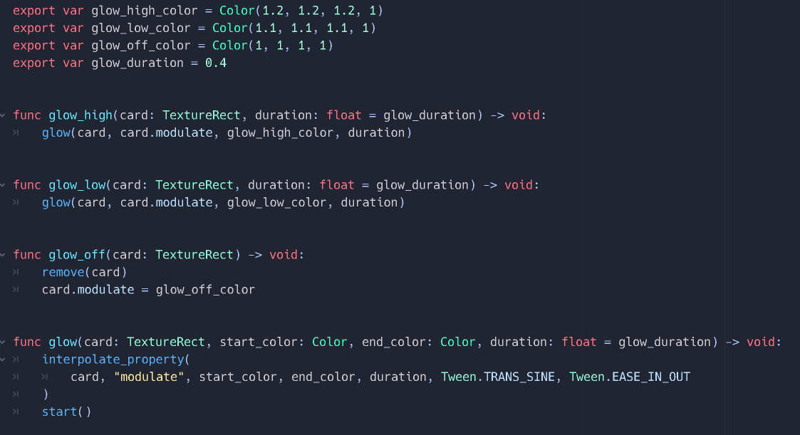

## Repo

Finished code (Godot project) can be found here:

https://github.com/justin-calleja/card-flipping/tree/tweening

This project builds off of the work started in ["Card flipping" post](../godot-card-flipping)

## Dealing cards

Create a new scene e.g. `tweening.tscn`, and pull in a `card.tscn` node and a `Button`. The card is going to represent the position of our deck of cards so we can set it's `TextureRect.texture` to the back card png image. Attach a script on the root node e.g. `tweening.gd`, extending `Node2D` and preloading the textures we'll need when we create a new card (dealt from the deck), as well as getting a ref to other nodes we'll be using. The `x_offset` is how much space we'll be leaving between each successively dealt card, and the `Node2D` named `DealPosition` is the position we'll be dealing the first card to (set this at some reasonable position on the canvas):



The `CardTween` node is just a custom script I made that `extends Tween`. Add a `card_tween.gd` script with this for now:

```gd
extends Tween
class_name CardTween

func move(
	card: TextureRect, initial_position: Vector2, target_position: Vector2, duration: float = 0.5
) -> void:
	interpolate_property(
		card,
		"rect_global_position",
		initial_position,
		target_position,
		duration,
		Tween.TRANS_CUBIC,
		Tween.EASE_OUT
	)
	start()

```

This makes it a little easier to move a Card and keeps things consistent (i.e. we can use the same function to move all cards).

Anyway, back to the `tweening.gd` script, we can create a new function to handle clicking the "Deal" button:

```gd
func _on_deal_pressed():
	deal_btn.disabled = true
	deal_cards(3)
```

We disable the button and deal 3 cards on click, but we still need to map the signal to this function - you can do that by selecting the Button node and going to the `Node` tab in the inspector and then doing the mapping for the `pressed` signal.



The `deal_cards` function takes a number of cards to deal; creates a card at the deck's position; tweens the card i.e. moves it to the target position; and calls itself with one less card to deal, obviously breaking the recursion when there's no more cards to deal:

```gd
func add_card_to_tree(card: Card) -> void:
	deal_pos.add_child(card)
	card.rect_global_position = deck.rect_global_position


func get_card_count() -> int:
	return deal_pos.get_child_count()


func new_card() -> Card:
	var card = Card.instance()
	card.back_texture = BackTexture
	card.front_texture = FrontTexture
	return card


func deal_cards(num_to_deal: int):
	if num_to_deal <= 0:
		# select_card_by_index(0)
		return

	var card = new_card()
	add_card_to_tree(card)
	var num_of_cards = get_card_count()
	# assert(card.rect_global_position == deck.rect_global_position)
	tween.move(
		card,
		card.rect_global_position,
		deal_pos.global_position + Vector2(x_offset * num_of_cards, 0)
	)
	yield(tween, "tween_all_completed")
	deal_cards(num_to_deal - 1)
```

Ignore `select_card_by_index` for now as that's for when we want to highlight the "selected" card via a glow effect (we'll do this later).

What's important here is the Card's starting position. This needs to be the `Deck`'s `rect_global_position` because that's where I'd like the animation to start from, however, I'm adding the new Cards as children of `DealPosition`. This is because I want to group them under that parent node (I also know that I'll be using `DealPosition` exclusively to parent dealt cards so I can rely on it's children's size being the number of cards currently dealt and e.g. not have to stay storing that info myself in an array - and updating manually everytime this count changes). I don't want to use `Deck` for this as `Deck` can have other child nodes and indeed it already does if you're using the `card.tscn` for it as that has an `AnimationPlayer`.

Now, since I add new cards to the `DealPosition`, their initial `global_rect_position` is going to be the `DealPosition`'s `global_position`, so when I add a card, I also change it's position to that of the deck's and I "abstract" this in the function `add_card_to_tree`.

Starting the tween from the deck will avoid any weird flickering at the end of the animation (i.e. in my experience just setting the tween's start and end position isn't enough. The object you're tweening needs to be at the start position for best results before `start`ing the tween).

After tweening (moving) the card, I'm waiting for the movement to finish before dealing another one but you could use a timer here and e.g. start dealing the next card before the previous one has finished moving to it's target position.

## Selecting a card with a glow effect

To get the glow effect working, we first add a `WorldEnvironment` node to the scene; (1) create an "Environment"; (2) change the `Background.Mode` to `Canvas`; (3) enable `Glow`; (4) optionally change `Blend Mode` to `Additive` for more glow and maybe tweak the `Strength`:



At this point, we are able to change a texture's raw value for a color channel to over `1` to get a glow effect on it. All that's left is to animate this color change over time to different values on the correct card and remove and apply to another card on player input.

To do this, we'll get started with the `select_card_by_index` function which is called with an argument of `0` when the cards are done being dealt:

```gd
var is_glow_high = false
var selected_card: Card = null

func get_card_by_index(index: int) -> Card:
	return deal_pos.get_child(index)


func select_card_by_index(index: int):
	var prev_selected_card = selected_card
	selected_card = get_card_by_index(index)

	if selected_card == null:
		selected_card = prev_selected_card
		return

	if selected_card == prev_selected_card:
		return

	if prev_selected_card != null:
		tween.glow_off(prev_selected_card)

	start_glow_card(selected_card)
```

The idea here is to try to get the node at the given index using the `DealPosition` (since that's where we're keeping the cards). If this operation gives us a `null`, then we want to leave the newly added script variable of `selected_card` to whatever it was prior to this function call - and if the retrieved card is the same as the one currently selected, then we'll just return. If it's a new card, we want to stop the glowing on the selected card and start glowing the new one.

To stop the glow, I'm removing the existing tweens on the given Card and changing it's `modulate` (color) to the `glow_off_color`. `modulate` effects all child nodes of Card as opposed to `self_modulate` which only effects the Card. For our purposes here, they are the same.

With regards to glowing, as seen from the code below, I'm basically changing the color (modulate) from "high" to "low" or vice versa by choosing a raw color value which exceeds `1` which will give us the glow effect thanks to the `WorldEnvironment` changes we made:



Back to where we left off after selecting a card; at the end of `select_card_by_index`, we call `start_glow_card` which basically just starts glowing at a high value and sets a flag to keep track of this:

```gd
func start_glow_card(card: Card):
	is_glow_high = true
	tween.glow_high(card)


func glow_card(card: Card):
	if is_glow_high:
		tween.glow_low(card)
	else:
		tween.glow_high(card)
	is_glow_high = !is_glow_high


func _on_tween_completed(obj: Object, key: NodePath):
	if key == ":modulate" and obj == selected_card:
		glow_card(selected_card)
```

When the tween completes (something we have yet to hook up), `_on_tween_completed` kicks in. However, we're tweening `modulate` and position with the same Tween node so we need to check using the key `NodePath` that this callback is handling a completion of a color change animation. If it is, we just `glow_card` again. `glow_card` triggers the correct glow (high or low) based on the flag and flips the flag. This ensures that the glowing keeps going.

Finally, we can add a `_input` function to handle user input of `"ui_right"` to select the card to the right of the currently selected one (move right) and loop back; `"ui_left"` to move left and loop back; and `"ui_select"` (space bar key) to just `flip` the card - a feature we added in the: ["Card flipping" post](../godot-card-flipping):

```gd
func _input(event):
	if selected_card == null:
		return

	if event.is_action_pressed("ui_right"):
		select_card_by_index((selected_card.get_index() + 1) % get_card_count())
	elif event.is_action_pressed("ui_left"):
		var last_card_index = get_card_count() - 1
		var selected_card_index = selected_card.get_index()
		select_card_by_index(
			last_card_index if selected_card_index <= 0 else selected_card_index - 1
		)
	elif event.is_action_pressed("ui_select"):
		selected_card.flip()
```
